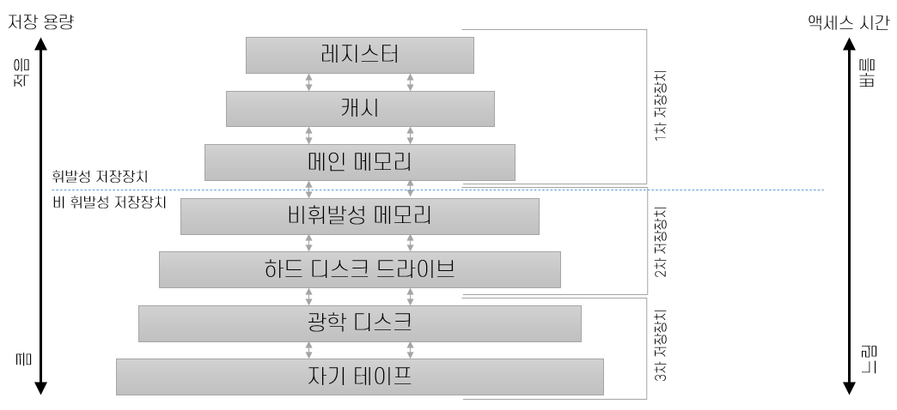

= Module03. 디스크와 파일

* 데이터베이스에 데이터를 넣으면 어떻게 저장이 되는가?

* 프로그램은 보조 기억 장치에 저장된다.
* 실행중인 프로그램은 주 기억 장치에 저장된다.

* 데이터도 마찬가지로 보조 기억 장치에 저장된다.
* 읽어야 하는 데이터는 메모리에 올라온다.

== 기억장치 계층 구조

=== 디스크와 파일 개요

image:images/database_structure.png[]

==== Query Optimazer
* 관계 대응식 (Relation Algebra)이 존재한다.
* 관계 대응식을 가지고 쿼리에 대한 실행 플랜을 생성한다.

=== 기억장치 계층 구조

== 디스크
=== HDD
* 기계 장치가 포함된 저장장치, 자기를 이용해 데이터를 저장하고 읽는다.
* 직접 접근 방식이 아닌 순차 접근 방식

=== SSD
* 플래시 메모리를 기반으로 한 저장 매체. Random Access 가능한 빠른 속도의 저장 장치.
* 모든 구성 요소가 전기장치 이다.

=== 디스크 성능
* HDD
** 접근 시간 = 탐색시간 + 회전 지연 시간 + 전송 시간

* SSD
** 전송 시간만 소요 되므로 일정한 응답 속도가 보장된다.
** 비어있는 공간이 없으면 공간을 초기화하고, 해당 작업동안 I/O 작업이 대기 상태가 된다.

== 디스크 공간 관리

=== 비어있는 블록의 추적 감시
* DBMS는 사용중인 디스크 블록과 어떤 블록에 존재하는지를 추적하고 감시한다.

** 디스크 관리자가 블록을 추적 감시하는 방법.
1. 비어있는 블록들의 리스트를 유지한다.
2.  디스크 블록마다 1비트씩 블록의 사용 여부를 나타내는 비트맵을 유지한다.

== 버퍼 관리자
=== 버퍼 풀

* 주 기억장치에서 페이지가 모여 있는 공간
* 프레임 : 버퍼 풀 내의 페이지를 담을 수 있는 슬롯.
* paging : 페이지를 프레임에 올리는 과정

* 쿼리를 실행하면 쿼리의 결과값을 메모리에서 처리한다.
* 프레임이 꽉 차버린다면?
** 다음 데이터를 읽을 때 페이지를 교체해야 한다.

pin count::
초기 값 0. 누가 page를 읽고 있다면 1이 되어 교체 대상이 되지 않는다.
dirty::
boolean 타입 변수로서, 페이지가 디스크로부터 버퍼 풀에 적재된 이후 수정된 적이 있는지를 나타낸다. +
dirty 값이 변경 되었다면 반드시 프레임의 페이지를 디스크에 저장해야 한다. (WAL) +
dirty 값이 변경 되면 log에도 기록을 남김.

=== 버퍼 교체 전략
==== LRU
==== Clock -> 가장 많이 사용한다.
==== FIFO
==== MRU
==== Random

=== 버퍼 관리 기법 비교
* 운영체제의 가상 메모리와 DBMS의 버퍼 관리자가 매우 비슷하게 동작한다.
* 운영체제 페이지 패턴보다 더 정확하게 예측해야 하므로 DBMS는 독자적인 페이지 교체 알고리즘을 사용해야 한다.

== 레코드 형식
* 페이지 안의 데이터가 어떤 데이터가 들어가는가.

=== 고정 길이 레코드
* 각 필드의 길이가 고정적, 필드의 수도 고정적
* 필드를 레코드에 연속적으로 저장한다.
* 필드의 크기가 고정이므로 데이터 공간의 낭비가 발생할 수 있다.

=== 가변 길이 레코드
* 필드의 길이가 가변적이다.
* 필드를 분리자로 구분하여 연속적으로 저장한다.

== 페이지 형식
* 페이지는 레코드가 탑재되는 슬롯의 모임
* 레코드는 <페이지 번호, 슬롯 번호> 쌍으로 식별된다.
* <페이지 번호, 슬롯 번호>의 쌍을 RID<Record ID>라 한다.

** 성능적인 측면에서는 고정길이 레코드가 유리.
** 효율적인 측면에서는 가변길이 레코드가 유리.

== 파일과 인덱스

=== 힙파일

=== 인덱스
* 대부분의 자료 구조에서는 저장된 데이터의 rid를 직접 알지 못한다.
* 정렬되지 않은 자료 구조에서 동등 검색을 수행할 경우, 전체 자료 구조를 스캔해야 한다.

* 인덱스 : 선택 조건에 맞는 rid를 구할 수 있도록 만든 보조 자료 구조

=== ISAM
=== B+ Tree

== 시스템 카탈로그
* 데이터베이스는 자신이 가지고 있는 모든 데이터에 대한 설명 정보를 저장한다,
* 관계형 데이터베이스 관리 시스템은 생성된 모든 릴레이션과 인덱스에 대한 정보를 유지하고 관리한다.

* 시스템 카탈로그는 관계형 데이터 형식으로 저장된다. 시스템 카탈로그는 릴레이션의 집합이다.
