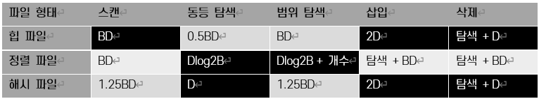

= Module04. 파일 조직과 인덱스

== 비용 모델과 파일 조직법
* 데이터베이스는 쿼리가 요청 될 때 여러 실행 계획을 세우고 비교해 최적화된 방법으로 쿼리를 실행한다.

=== 비용 모델 개요
* 쿼리 최적화기는 두가지로 생각할 수 있다.
1. 규칙 기반 옵티마이저
** 미리 정해놓은 규칙에 따라 액세스 경로를 평가하고 실행 계획을 선택한다.
2. 비용기반 옵티마이저
** 쿼리를 수행하는데 소요되는 일의 양 또는 시간을 기반으로 최적화된 실행 경로를 계산한다.

* B : 페이지 수
* R : 페이지의 레코드 수
* D : 디스크에 페이지를 쓰는 시간
* C : 하나의 레코드 처리 시간
* H : 레코드 해시 함수 처리 시간

=== 파일 조직법 개요
* 파일 조직법 비교 기준 연산
** 스캔 Scan
*** 파일에 있는 모든 레코드를 가져온다. 페이지는 디스크로부터 버퍼 풀로 반입 되어야 한다.
** 동등 셀렉션 (Equality Selection)
*** 쿼리에서 요구하는 검색어와 같은 문자열을 만족하는 모든 레코드를 가져온다.
** 범위 셀렉션 (Range Selection)
*** 1~10까지, 홍길동에서 이순신까지 등 범위에 해당하는 모든 레코드를 가져온다.
** 삽입 (Insertion)
*** 주어진 레코드를 파일에 삽입한다.
** 삭제 (Deletion)
*** RID로 명세된 레코드를 삭제한다.

* 힙 파일은 저장 성능이 우수하고 스캔, 삽입, 삭제 연산이 빠르나 탐색은 느리다.
* 정렬 파일은 저장 성능이 우수하고, 삽입과 삭제 연산은 느리지만 탐색은 빠르다.
* 해시 파일은 저장 성능이 떨어지지만, 삽입과 삭제가 빠르며 동등 탐색에서 우수하다. 하지만 범위 탐색은 지원하지 못하며 스캔 성능이 떨어진다.

** 범용으로 우수한 파일은 정렬 파일이다.

=== 파일 조직 선택

== 인덱스
* 어떤 테이블을 검색 속도를 높이기 위한 보조 자료 구조

=== 클러스터드 인덱스

* 파일을 조직할 대 레코드의 순서를 파일에 대한 인덱스의 순서와 동일한 순서로 유지하는 인덱스
* 파일의 재조직이 필요한 구조.
** 데이터가 삽입/삭제될 때 마다 정렬 순서를 유지하기 위해서 그 주변의 데이터를 이동해야 한다.
** 파일이 동적으로 변하는 경우 유지 관리 비용이 높다.

* 무조건 정렬된 파일이다.

=== 넌 클러스터드 인덱스

* 하나의 데이터 파일은 하나의 탐색키에 대해서만 클러스터링 될 수 있다.

=== 밀집 인덱스와 비밀집 인덱스

==== 밀집 인덱스
* 파일에 있는 모든 탐색 키 값에 대해 데이터 엔트리를 구성

==== 희소 인덱스
* 데이터 파일의 페이지별로 하나의 데이터 엔드리를 구성

=== 기본 인덱스와 보조 인덱스
==== 기본 인덱스
* 기본 키를 포함한 필드들에 대한 보조 인덱스

==== 보조 인덱스
* 기본 키 이외의 인덱스들

==== 유일 인덱스
* 해당 탐색 키에 후보 키가 포함되는 경우

=== 복합 인덱스
==== 복합 키, 접합 키
* 인덱스가 여러 개의 필드를 포함하는 경우