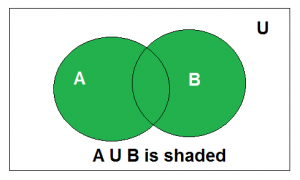
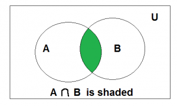
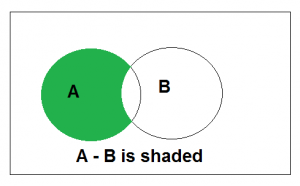
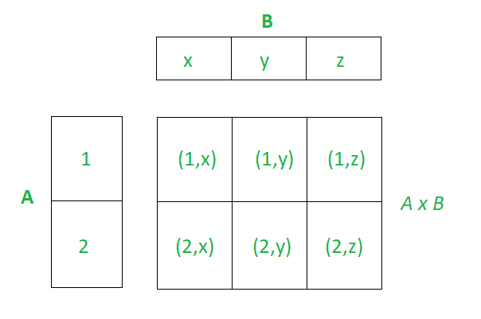

= Module 05. 관계 대수와 관계 해석

== 관계 대수 개요
=== 관계 대수 (Relational Algebra)
* 관계 모델에 관한 두 가지 형식 질의어 중 하나. 연산자들의 모임을 사용해서 대수로 표현된다.
* 대수로 표현되는 성질로 인해 연산자들을 조합해 복잡한 질의를 만들기 쉽다.
* 관계 대수의 모든 연산자는 하나 또는 두 개의 릴레이션 인스턴스를 파라미터로 하여 하나의 릴레이션 인스턴스를 반환한다.
* 셀렉션, 프로젝션, 합집합, 교집합, 카티션 프로덕트 같은 기본 연산자가 존재한다.

=== 관계 대수식 (Relation Algebra Expession)
* 연산자들의 모임을 사용해서 구성된 대수식이다.
* 한 릴레이션, 단일 식에 적용한 단항 대수 연산자, 또는 두 개의 식에 적용한 이항 대수 연산자로 순환적으로 정의 된다.

=== 관계질의
* 연산자의 적용 순서를 통해 원하는 답을 구할 수 있는 계산 절차를 한 단계씩 묘사한 것.
* 대수가 절차적인 성질을 가지고 있기 때문에 질의 수행을 위한 일종의 계획이 될 수 있다. (RDBMS)

== 셀렉션과 프로젝션

=== 셀렉션 = 시그마 ( δ )
* 릴레이션에서 튜플들을 선택(Selection) 할 수 있는 연산자
* 셀렉션 조건을 통해 튜플들을 명세한다.
* 비교 연산자 중의 하나를 통해 항들을 boolean으로 조합한 것.

=== 프로젝션 = 파이 ( π )
* 필드들을 추출(Projection) 할 수 있는 연산자

== 집합 연산
* 합집합, 교집합, 차집합, 카티션 프로덕트와 같은 표준 집합 연산.

=== 합집합 (Union, ∪)

* R ∪ S 는 릴레이션 인스턴스 R이나 릴레이션 S 또는 양쪽 보두에 속하는 튜플들을 모두 포함하는 릴레이션 인스턴스를 만든다
* R과 S는 합병 가능 해야 하며 결과 스키마는 R의 스키마와 동일하다.

==== 합병 가능?
* 필드의 수가 같고 왼쪽부터 오른쪽으로 가면서 순서대로 대응되는 필드들의 도메인이 같다.

=== 교집합 (Intersection, ∩)

* R ∩ S 는 R과 S 양쪽에 함께 속하는 모든 튜플로 구성된 릴레이션 인스턴스를 만든다.
* R과 S는 합경 가능해야 하며, 결과 스키마는 R의 스키마와 동일하다.

=== 차집합 (Set-different, –)

* R – S 는 R에는 속하고 S에는 속하지 않는 튜플로 구성된 릴레이션 인스턴스를 만든다.
* R과 S는 합병 가능해야 하며, 결과 스키마는 R의 스키마와 동일하다.

=== 카디션 프로덕트 (Cartisian Product, X)

* R X S 는 R의 모든 필드와 S의 모든 필드를 순서대로 가지는 스키마의 릴레이션 인스턴스를 만든다;
* R X S에는 r∈R, s∈S 쌍에 대하여 튜플 <r, s>를 하나씩 가진다.
* <r, s> 는 튜플 r과 튜플 s를 접합 (concatenation) 하여 만드는 튜플을 의미한다.
* 결과 릴레이션에는 같은 이름을 가지는 필드들이 있을 수 있다. (명명 충돌) -> 이름을 붙이지 않고 그 위치로만 지징한다.

[source, SQL]
----
# 도착지가 프랑크푸르트거나 출발지가 LA인 항공편의 시간을 검색.
SELECT 시간
FROM 항공편
WHERE 도착지 = '프랑크푸르트' OR 출발지 = 'LA';

# 유니온 해결방법
SELECT 시간
FROM 항공편
WHERE 도착지 = '프랑크푸르트'
UNION
SELECT 시간
FROM 항공편
WHERE 출발지 = 'LA';
----

== 이름 바꾸기

=== Remaining = 로우 ( ρ )
* 릴레이션에서 필드의 이름을 변경 할 수 있는 연산자
* 관계 대수식 내부에서 이름 충돌이 발생할 수 있다.
* 릴레이션 인스턴스의 이름을 주는 것이 편리하다.
* 긴 대수식을 작은 부분으로 나누어 결과 인스턴스에 이름을 줄 수 있도록 하는 것이 편리하다.

== 조인

* 둘 이상의 릴레이션으로 부터 정보를 조합하는 연산
* 카디션 프로턱드 결과와 동일하지만 훨씬 적은 결과를 산출하기 때문에 조인으로 구현하는 것이 유리하다.

[%header, cols="1,1,3" width=95%]
|===
|종류	|기호	|기능
|동등 조인	|⋈	|두 릴레이션간의 값을 가진 집합
|세타 조인	|⋈θ	|두 릴레이션 간의 비교 조건에 만족하는 집합
|자연 조인	|⋈N	|동등 조인에서 중복 속성을 제거
|세미 조인	|⋉ and ⋊ 	|자연 조인 후 기호의 열린쪽의 속성을 제거
|외부 조인 Left|⟕	 	|자연 조인 후 왼쪽의 모든 값을 추출, 값이 없을 경우 한쪽의 값을 NULL로 채용
|외부 조인 Right|⟖	 	|자연 조인 후 오른쪽의 모든 값을 추출, 값이 없을 경우 한 쪽의 값을 NULL로 채용
|외부 조인 Full|	⟗ 	|자연 조인 후 양쪽의 모든 값을 추출, 값이 없을 경우 한 쪽의 값을 NULL로 채용
|===

[source, SQL]
----
# 출발지가 LA인 비행기의 기종을 검색.
SELECT 비행기.기종
FROM 비행기 JOIN 항공편 ON 비행기.비행기ID = 항공편.비행기ID
WHERE 항공편.출발지 = 'LA'

# 이순신이 예약한 비행기의 기종을 검색.
SELECT 비행기.기종
FROM 승객 JOIN 항공편 ON 승객.승객ID = 항공편.승객ID
         JOIN 비행기 ON 항공편.비행기ID = 비행기.비행기ID
WHERE 승객.이름 = '이순신'
----

== 튜플 관계 해석
* T(튜플 변수) | p(T)(Formula - T를 묘사하는 식 )} 형식으로 튜플 간의 관계를 해석한다.

