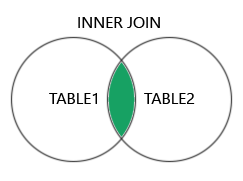

= SQL

* Structured Query Language

비 절차적 언어?::
'어떻게' 보다는 '무엇'을 말한다.

== 구성

|===
|명령어 |종류	|명령어
|DML
|SELECT +
INSERT +
UPDATE +
DELETE
|데이터베이스의 데이터를 조회하거나 검색하기 위한 질의 모음으로 RETRIEVE라고도 함 +
데이터베이스 테이블의 데이터에 변형을 가하는 종류(삽입, 수정, 삭제)등의 질의어

|DDL
|CREATE +
ALTER +
DROP +
RENAME +
TRUNCATE +
|테이블, 뷰, 저장 프로시저 등의 데이터 구조를 정의하는데 사용되는 명령어로, 생성, 변경, 삭제, 이름 변경등의 데이터 구조와 관련된 질의어

|DCL
|GRANT +
REVOKE +
DENY +
|데이터베이스에 접근하고 객체들을 사용하도록 권한을 주고 회수하는 질의어

|TCL
|COMMIT +
ROLLBACK +
SAVEPOINT +
|논리적인 작업 단위를 묶어서 DML에 의해 조작된 결과를 트랜잭션별로 제어하는 질의어
|===

* DML
** 데이터를 조회하거나 검색하기 위한 명령
** 데이터베이스 테이블의 데이터에 변형 (삽입, 수정, 삭제)를 하는 질의어

* DDL
** 테이블, 무결성 등의 데이터 구조를 정의하는데 사용하는 질의어

* DCL
** 데이터베이스에 접근하고 개체들을 사용하도록 권한을 주고 회수하는 질의어

* TCL
** 논리적인 작업의 단위를 묶어 DML에 의해 조작된 결과를 트랜잭션 별로 제어하는 질의어

== DDL : Data Definition Language
* 데이터를 정의하는 컴퓨터 언어 또는 컴퓨터 언어 요소
* SQL에서는 관계 데이터베이스의 구조를 정의하는 SQL 언어의 부분집합

=== CREATE
릴레이션(테이블), 뷰, 인덱스, 저장 프로시저 등 DB 객체 생성

* 테이블, 도메인(데이터 타입), 인덱스, 사용자, 별칭, 저장 프로시저, 사용자 정의 함수, 트리거, 데이터베이스

[source, console]
----
CREATE [데이터베이스 객체 형식] [객체 이름]
[객체의 종류에 따른 질의]
----

[source, console]
----
CREATE TABLE {table name} (
    [Column Name] [Data Type] {NULL | NOT NULL} {Column Option}
    {Constraint LIST} [Constraint definition]
)
----

=== DROP
존재하는 DB 객체 삭제
* 대부분의 RDBMS에서 DROP 문을 통해 삭제한 객체는 복원 이외의 방법으로는 되살릴 수 없다.

[source, console]
----
DROP [데이터베이스 객체 형식] [객체 이름]
----

[source, console]
----
DROP TABLE [TableName]
----

=== ALTER
존재하는 DB 객체 수정

* 테이블의 경우 ALTER 문을 통해 도메인, 개체 ,참조 무결성을 위한 각 제약조건을 변경할 수 있고, 컬럼명을 변경 할 수 있다. DB 종류에 따라서 테이블의 이름을 바꾸는데 RENAME 문이 사용될 수 있다.

[source, console]
----
ALTER [데이터베이스 객체 형식] [객체 이름]
[객체의 종류에 따른 질의]
----

[source, console]
----
ALTER TABLE [TableName]
    {ALTER COLUMN} [COLUMN NAME] {Column Option}
    {ADD} {Column | Constraint} {ADD Option}
    {DROP} {Column | Constraint} {DROP Option}
----

=== TRUNCATE
테이블 내 데이터의 완전 삭제. + 
무결성 제약조건을 생략하여 모든 데이터의 빠른 삭제를 가능하게 한다.

DELETE 문과의 차이점::
* WHERE 절을 추가할 수 없다.
* 대상 테이블에 대한 단독 잠금을 얻을 수 있다.
* 삭제시 외래 키의 무결성을 확인하지 않는다.
* 일부 데이터베이스에서 TRUNCATE문은 롤백 할 수 없다.
* 일부 데이터베이스에서 복제 및 로그 전달 대상인 테이블에 대해 실행할 수 없다.

[source, console]
----
TRUNCATE [TABLE] 테이블 이름 [, 테이블 이름]
----

== DML : Data Manipulation Language

[source, console]
----
SELECT [DISTINCT] select-리스트
FROM from-리스트
WHERE 조건식
----

=== SELECT
* 관계 대수의 프로젝션 연산과 일치한다. 결과에 나타날 속성을 나열하는데 사용된다.

* 형식 질의 언어는 릴레이션 집합이라는 수학적인 개념에 바탕을 두고 있다.
** 중복된 튜플은 릴레이션에서 나타날 수 없다.
** 중복성 제거는 시간 소비성 작업이므로, SQL은 프로젝션 결과 뿐 아니라 릴레이션에서도 중복을 허용한다.
** 조회결과에 중복이 없어야 하는 경우 DISTINCT 키워드를 사용한다.
** ALL 키워드를 사용하여 중복을 허용 하며 기본값은 중복을 허용한다.

=== FROM
* 관계 대수의 카티션 프로덕트에 해당한다. 질의에서 조회할 릴레이션을 나열한다.

* 범위 변수를, 사용해 릴레이션의 별칭을 정의할 수 있다.
* 자연 조인은 카티션 프로덕트, 셀렉션 연산, 프로젝션 연산으로 수행된다.
* 하나 이상의 릴레이션 싀마에서 나타나는 속성의 모호성을 피하기 위해 relation-name.attribute.com 표기법을 사용한다.
* 외부 조인을 수행할 수 있는 확장을 포함한다.

=== WHERE
* 관계대수에서 셀렉션 연산과 일치한다. FROM 절에 나타나는 릴레이션 속성들의 조건으로 구성된다.

SUM()::
[source, console]
----
SELECT SUM(Age)
FROM Passenger;
----

COUNT()::
[source, console]
----
SELECT COUNT(PassengerNo)
FROM Passenger
WHERE Age >= 40;
----
* null 값은 세지 않는다.

== JOIN

INNER JOIN::

LEFT (OUTER) JOIN::

RIGHT (OUTER) JOIN::

FULL (OUTER) JOIN::

== 집합 연산
=== UNION
* 관계 대수의 합집합에 대응한다.
* 두 SQL 질의의 결과가 합병 가능한 조건이면 `UNION` 연산이 가능하다.
* 기본적으로 중복을 허용하지 않는다. (`UNION ALL` 키워드를 통해서 중복을 허용할 수 있다)

=== INTERSECT
* 관계 대수의 교집합에 대응한다.
* 두 SQL 질의의 결과가 합병 가능한 조건이면 `INTERSECT` 연산이 가능한다.
* 기본적으로 중복을 허용하지 않는다. (`INTERSECT ALL` 키워드를 통해 중복을 허용할 수 있다)

=== EXCEPT
* 관계 대수의 차집합에 대응한다.
* 두 SQL 질의의 결과가 합병 가능한 조건이면 `EXCEPT` 연산이 가능한다.
* 기본적으로 중복을 허용하지 않는다. (`EXCEPT ALL` 키워드를 통해 중복을 허용할 수 있다)

== 서브 쿼리
* 기본적으로 사용을 안하는게 좋지만 어쩔 수 없이 써야 하는 경우가 존재.

=== 포함된 서브 쿼리 (Nested Query)
* WHERE 절에서 데이터를 필터링하기 위한 값을산출하는 형태의 쿼리

==== 단일행 서브 쿼리 (Single Row Subquery)
* 쿼리의 결과가 하나의 Row만을 산출한다.

==== 다중행 서브 쿼리 (Multi Row Subquery)
* 쿼리 결과가 여러 Row를 산출한다.

==== 다중 컬럼 서브 쿼리 (Multi Column Subquery)
* 전체 테이블을 비교하기 보다 일부만을 불러와 그 중에서 셀렉션 하는 것이 비교 횟수가 적다.

IN::
다수의 비교값과 비교하여 하나라도 같은 값이 있으면 결과를 반환한다.

ANY::
IN 연산과 동일하지만 비교연산을 사용할 수 있다.

[cols="2,5"]
|===
^s|형식
^s|설명

|=ANY
|하나라도 만족하는 값이 있으면 반환

|>ANY
|값들 중 최소값보다 크면 반환

|>=ANY
|최소값보다 크거나 같으면 반환

|<ANY
|최대값보다 작으면 반환

|<=ANY
|최대값보다 작거나 같으면 반환

|<> ANY
|모든 값들 중 다른 값만 반환
|===

ALL::
ANY 연산과 비슷하지만 모든 값이 만족해야 한다.

=== 인라인 뷰 (Inline View)
* FROM절에서 사용되는 서브쿼리

* 인라인 뷰를 사용하면 조인을 회피하거나 개별 쿼리를 단일 쿼리로 통합해 복잡한 쿼리를 단순화 할 수 있다.

=== 스칼라 서브 쿼리 (Scala Subquery)
* select 절에 포함된 서브 쿼리
* 스칼라 서브 쿼리의 반환 값은 하나의 레코드에서 단일 컬럼이어야 한다.

* 조인이 많아 제어가 어려울 경우에 사용한다.
=== 연관 서브 쿼리
* 서브 쿼리가 주 쿼리의 필드 값과 연관되어 사용하는 질의

주 쿼리의 한 Row에 따라서 서브 쿼리가 한번씩 사용된다.

* 결과 집합이 대량인 경우 효율이 떨어진다.

== 집단 연산
=== 집계 함수
* COUNT
* SUM
* AVG
* MAX
* MIN

=== GROUP BY, HAVING
* GROUP BY
** 컬럼의 값을 기준으로 튜플을 그룹화 한다.
* HAVING
** 그룹에 대한 조건식을 지정한다.

== 정렬

=== ORDER BY

* desc 오름차순
* asc 내림차순 (기본값)

=== INDEX
[source]
----
CREATE INDEX [INDEX 이름] ON [정렬 기준]
----

== INSERT
