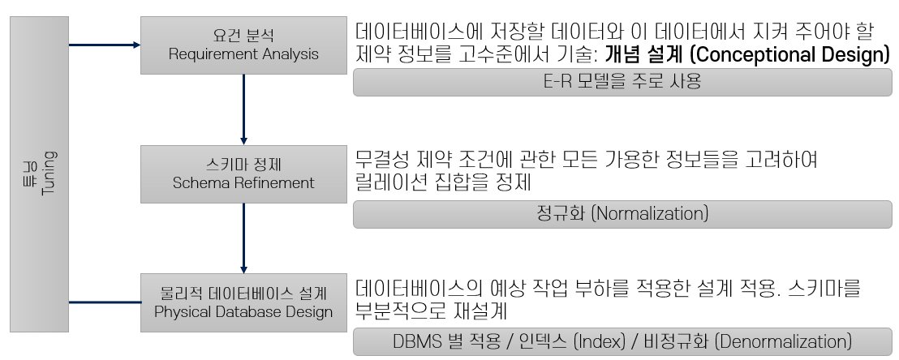
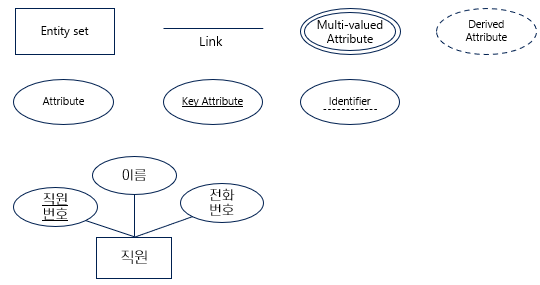
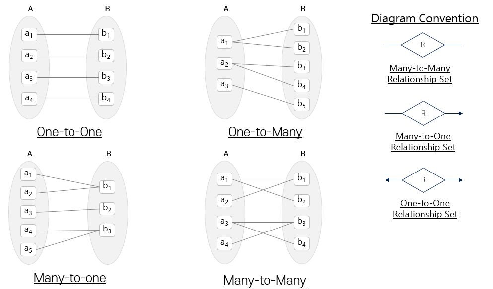

= ER Model

== 데이터베이스 설계

=== 요건 분석
* 데이터베이스에 어떤 정보를 저장해야 하는가와 그 데이터에 어떤 무결성 제약조건 또는 규칙을 적용해야하는가.

==== 개념적 설계
* 모든 정보들을 사용해서 데이터베이스에 저장할 데이터와 이 데이터가 지켜야할 제약조건들을 고수준에서 기술하는 것.
* 주로 ER 모델을 사용한다.

=== 스키마 정제
* 무결성 제약 조건에 관한 모든 정보들을 고려해서 이 릴레이션 집합을 정제하는 일.
* 개념적 설계 단계는 주관적인 단계이지만 스키마 정제는 세련되고 강력한 이론으로 방향을 잡을 수 있다.

==== 정규화
* 릴레이션들이 바람직한 성질을 가지도록 재조직하는 방식

=== 물리적 데이터베이스 설계
* 데이터베이스가 지원해 주어야 할 예상 작업 부하를 고려, 이후 데이터베이스 설계를 정제하여 원하는 성능 기준에 맞게 해야 한다.

=== 튜닝
개념적 설계 -> 스키마 정제 -> 물리적 설계
* 이 세 종류의 설꼐 단계를 반복적으로 수행해 조정하는 과정.

== 개체 관계 데이터 모델
* 데이터를 개체(Entity), 속성(Attribute), 관계(Relationship)로 나타낸 모델
* 실세계를 개체라 불리는 기본 객체들과 그 객체들 사이의 관계로 인식한다.
* 전체 논리적 구조를 나타내는 조직의 스키마를 명시함으로써 쉽게 설계하도록 개발되었다.
* 실세계의 조직의 의미와 상호작용을 개념적 스키마로 나타내는데 유용하다.

=== 스키마
* 스키마 정제 단계의 산출물
* meta data
* 엔티티에 대한 상세 정보를 명세한다.
* ex ) 학생 (학번: 정수, 이름: 문자열, 생년월일: ...)

=== 개체, 속성, 개체 집합

==== 개체 (Entity)
* 실제 세계에서 다른 객체와 구별되는 유, 무형의 사물

==== 속성 (Attribute)
* 한 개체를 기술하기 위한 속성
* 한 개체 집합에 속한 모든 개체들은 동일한 속성을 갖는다.
* 가능한 값의 집합인 Domain을 지정하며, 개체를 식별하기 위한 Key를 지정한다.

** 단순 속성, 복합 속성
** 단일값 속성, 다중값 속성
** 유도된 속성

==== 개체 집합 (Entity Set)
* 개체들의 집합
* 물리적 설계의 테이블에 해당

=== 관계, 관계 집합

==== 관계
* 여러 개체들 사이의 연관성

==== 관계 집합
* 같은 유형의 관계들의 집합.

== ER 모델 기능

=== 대응수
* 참여 제약 조건을 이루는 관계 비율

{empty}

개체 집합 A와 B 사이의 관계 집합 R에서의 대응 수::
* One-to-One 일대일
** A의 한 개체는 B의 한 개체와 연관을 가지고 B의 한 개체는 A의 한 개체와 연관을 가진다.
* One-to-Many 일대다
** A의 한 개체는 임의의(0 ~ N) B 개체와 연관을 가진다. B의 한 개체는 A의 한 개체와 연관을 가진다.
* Many-to-One 다대일
** A의 한 개체는 B의 한 개체와 연관을 가진다. B의 한 개체는 임의의(0 ~ N) A 개체와 연관을 가진다.
* Many-to-Many 다대다
** A의 한 개체는 임의의 B 개체와 연관을 가지고 B의 한 개체도 임의의 A 개체와 연관을 가진다.

=== 키 제약 조건
* 릴레이션에서, 키 제약 조건에 따라 대응 수가 정해진다.
* 개체 집합 E가 관계 집합 R에 대해서 키 제약조건이 존재한다면 E 인스턴스에 속한 각 개체는 R 인스턴스에 속한 관계중 하나에만 나타난다.

* 관계 집합의 대응 수는 관계 집합이 모델링하는 실 세계의 상황을 따라야 한다.

=== 참여 제약 조건
==== 전체적 참가
* 한 개체집합 E의 관계집합 R의 참가는 모든 E의 개체가 적어도 R 내부의 한 관계에 참가한다.

==== 부분적 참가
* 개체집합의 일부 개체만 관계에 참여한다.

=== 약 개체 집합
* 키가 존재하지 않는 개체집합이다.
** 자신의 일부 속성과 다른 개체의 Primary Key를 조합해서 식별된다.
** 다른 개체를 식별 소유자(Identity Owner)라 한다.

* 다음 조건을 반드시 성립해야 한다.
** 식별 소유자와 약 개체집합은 One-to-Many(일대다) 관계 집합이 성립되어야 한다.
** 약 개체 집합은 식별 소유자의 관계 집합에 전체적으로 참가해야 한다.
** 소유자 개체에 대해 약 개체 하나를 식별해 주는 속성 집합을 약 개체 집합에 대한 구별자 또는 부분 키 라고 한다.

약 개체집합과 식별 소유자에 대한 예시로 직원 - 부양가족을 들 수 있다.

=== 전문화와 일반화
하나의 개체 집합은 집합 내 다른 개체들과 구분되는 개체들의 하위 집합을 가질 수 있다. 

==== 전문화
* 어떤 개체집합 (슈퍼클래스) 중에서 다른 것들로부터 구별되는 어떤 특성을 공유하는 일부 집합을 식별해 내는 과정.

==== 일반화
* 여러 개체 집합에서 공통적인 특성을 추출해서 그러한 공통 특성을 가지는 개체들을 모든 큰 개체집합으로 만들어 내는 것.

==== 포함 제약 조건
* 중첩 제약 조건
** 두 서브 클래스에 같은 개체가 포함될 수 있는가
* 포괄 제약 조건
** 서브 클래스의 모든 개체를 모으면 슈퍼 클래스의 모든 개체가 되는가

== 개념적 설계 고려사항

=== ER 모델을 이용한 개념적 설계
* ER 다이어그램 개발 과정은 선택의 연속이다.
* ER 다이어그램은 데이터를 최대한 비슷하게 설명할 뿐이다. 모든 요구사항의 의미를 표현할 수 없다.
* ER 모델링은 데이터 설계에 대한 완벽한 방식이 아니다. ER 다이어그램을 변환하여 얻은 릴레이션에 대한 스키마 정제가 필요하다.

=== 개체 OR 속성

* 속성
** 한 개체가 속성을 단일 값으로 가지는 경우
** 요구 사항에서, 수직, 수평적으로 분리될 수 없는 값
* 개체
** 한 개체가 여러 값을 가지는 경우
** ER 다이어그램에서 주소의 구조를 표현해야 하는 경우

=== 개체 OR 관계

* 개체
** 관계가 관계로 생성되는 한 개체에 국한되는 속성을 가진다.
** A 집합의 개체가 B 집합의 한 개체에만 해당할 때
* 관계
** 관계집합에서 중복이 발생하는 경우
** 두 개체 사이에 일어나는 동작을 기술하는 경우

=== 이진관계 OR 삼진관계
* 이진관계
** 약 개체가 포함되는 경우
** 관계의 변화가 개체에 영향을 미치는 경우
* 삼진관계
** 관계의 변화가 개체에 영향을 미치는 경우
** 식별 관계의 체인이 존재하지 않는 경우