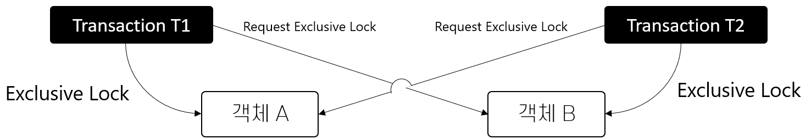
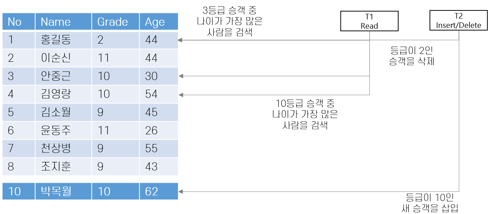

= Module12. 병행성 제어

* DB 의 공유 자원 ?
** Record

* DB 의 프로세스 ?
** Transaction

== 트랜잭션
* 데이터베이스 객체들에 대한 일련의 판독(READ) 또는 기록(WRITE)
** 판독 : 객체의 내용이 디스크에서 버퍼풀의 프레임으로 페이징 된다.
** 기록 : 프레임의 객체 복사본이 수정된 후 디스크에 기록한다.

* ACID
** Atomicity (원자성)
*** 트랜잭션과 관련된 작업들이 부분적으로 실행되다가 중단되지 않음을 보장한다.
** Consistency (일관성)
*** 실행을 완료하면 언제나 일관성 있는 데이터베이스 상태로 유지됨을 보장한다.
** Isolation (격리성)
*** 트랜잭션 수행 시 다른 트랜잭션의 연산작업이 끼어들지 못하도록 보장한다.
** Durability (지속성)
*** 성공적으로 수행된 트랜잭션은 영구적으로 데이터베이스에 반영됨을 보장한다.

=== 트랜잭션과 일관성
* 트랜잭션의 인터리빙과 관계 없이 모든 트랜잭션은 순서대로 실행한 결과를 보장해야 한다.
* DBMS는 서로 다른 트랜잭션 단위 작업을 인터리빙.
** 실행한 실제 효과가 트랜잭션들을 선형으로 실행한 것과 동등하도록 보장한다.
* 손상 복구
** 트랜잭션이 정상적으로 완료되지 못하는 경우
*** 트랜잭션을 철회 하는 경우
*** 시스템 손상
*** 예상치 못한 상황
** 일관성 보장을 위해서 미완료 트랜잭션의 단위 작업을 철회한다.

=== 트랜잭션과 스케줄
* DBMS 관점에서 트랜잭션 하나는 단위 작업들의 나열
** 부분적으로 순서화 된 집합으로 정의 할 수 있다.
* 트랜잭션 T에서 객체 O를 읽는 작업
** 판독 단위 작업 R(O)
** 기록 단위 작업 W(O)
** 철회 작업 A
** 완결 작업 C
* 트랜잭션 스케줄
** 어떤 트랜잭션에 있는 단위 작업의 리스트
** DBMS가 보는 트랜잭션의 단위 작업들을 기술
** 각 트랜잭션에 Abort와 Commit 연산을 넣은 스케줄을 완전한 스케줄
** 다른 단위 작업이 인터리빙 되지 않는 경우 직렬 스케줄

‼️ drop은 트랜잭션이 아니다.

== 일관성
=== 직렬 가능성
* 직렬 가능 스케줄
** 일관적인 데이터베이스 인스턴스에 대한 효과가 완결된 트랜잭션 집합 S에 대한 완전한 직렬 스케줄의 효과와 동등함이 보장되는 스케줄.
** 주어진 스케줄을 수행해서 나온 데이터베이스 인스턴스는 해당 트랜잭션들을 직렬 순서대로 수행해서 나온 데이터베이스 인스턴스와 동등하다.
* 트랜잭션을 똑같이 직렬로 수행해도 순서를 바꾸면 결과가 다를 수 있다.
* Abort 된 트랜잭션이 있는 스케줄 까지 포함하지는 않는다.

=== 교차 수행에 의한 일부 이상
* 트랜잭션 T1과 T2의 작업이 충돌하는 경우
** 기록 판독 충돌(WR)
** 판독 기록 충돌(RW)
** 기록 기록 충돌(RR)

==== 기록 판독 충돌 (WR Conflict)
* 미 완결된 데이터를 읽는 경우
** 트랜잭션 T1이 수정한 데이터베이스 객체 A를, T1이 Commit되기 전에 T2가 판독하는 경우
** DIRTY READ

image:/images/wr-conflict.png[]

==== 판독-기록 충돌 (RW Conflict)
* 반복 불가능한 읽기를 수행하는 경우
** T1이 객체 A를 판독중에 T2가 객체 A의 값을 변경하는 경우

==== 기록-기록 충돌 (WW Conflict)
* 미 완결된 데이터를 덮어 쓰는 경우
** T1이 어떤 객체 A의 값을 수정하고, 진행 중인 상태에서 R2가 값을 덮어 쓰는 경우
** Blind Write - 맹목 기록

== LOCK
* Shared Lock (S)
* Exclusive Lock (X)

=== Lock Mode
* 직렬성을 보장하기 위한 방법
* 데이터 객체들이 상호 배타적으로 액세스 되도록 한다.
* 한 트랜잭션이 한 데이터 객체에 액세스 했을 때 다른 트랜잭션이 해당 객체를 수정하지 못하게 한다.
* 다중 트랜잭션 환경에서 데이터베이스의 일관성과 무결성을 유지하기 위한 순차적인 진행을 보장한다.

=== Shared Lock Mode
* 다른 트랜잭션에서 데이터를 읽을 수 있다.

=== 2 Phase Lock
1. T가 어떤 객체를 수정하려면 그 객체에 대한 잠금을 요청
2. 종료될 때 가지고 있던 모든 잠금을 푼다.

== 잠금 기반 병행 제어

=== 잠금 관리 
* DBMS는 잠금 관리자를 제공한다.
** 잠금 테이블과 트랜잭션 테이블을 유지
** 잠금 테이블 엔트리로 객체에 대한 잠금 정보를 관리한다.

* 잠금 요청과 잠금 해제 요청 구현
** Shared Lock을 요청하고 요청 큐가 비어있고, 해당 객체가 현재 Exclusive로 Lock 되어 있지 않은 경우 Lock Manager는 Lock을 허가하고 해당 객체에 대한 Lock Entry를 갱신한다.
** Exclusive Lock을 요청하고 그 객체에 대한 Lock을 가진 트랜잭션이 없는 경우 Lock을 허가하고 Lock Table Entry를 갱신한다.
** 이 밖의 경우 Lock이 바로 허가 될 수 없다.
*** Lock Request Queue에 요청을 추가

=== Dead Lock
* 두 트랜잭션이 잠금 해제를 기다리는 경우

* 논리적으로 교착상태를 막을 수 있는 방법이 없다.
** 예방을 통해서 프로세스의 시작을 막는다
** 탐지로 교착상태를 검출하여 프로세스를 kill

==== 교착상태 예방
* 트랜잭션마다 우선순위를 부여한다.
* 우선 순위가 낮은 트랜잭션은 우선순위가 높은 트랜잭션을 기다릴 수 없도록 하여 예방한다.
* 우선순위 지정에는 타임 스탬프를 사용한다.

* 잠금 관리자가 사용하는 전략
1. Wait-Die
*** 자신의 우선순위가 높으면 기다리고 그렇지 않으면 철회한다.
2. Wound-Wait
*** 자신의 우선순위가 더 높으면 상대를 철회하고, 그렇지 않으면 자신이 기다린다.

==== 교착상태 탐지
* 발생 후 탐지해서 해결하는 것이 좋을 수 있다.
** DBMS는 주기적으로 Deadlock인지를 점검한다.
* 잠금 관리자는 Wait-for 그래프라는 자료구조를 유지하며 교착상태를 탐지한다.
** 잠금 관리자는 잠금 요청이 큐에 들어올 때 마다 그래프에 간선을 추가, 허가 후 삭제한다.

== 특수한 잠금 기법
=== 동적 데이터베이스와 팬텀 문제

==== 인덱스 잠금 (index locking)
* 인덱스가 없어서 파일에 있는 모든 페이지를 살펴보아야 한다면, 기존 페이지들을 모두 잠금하고 파일에 새 페이지가 추가될 수 없도록 만들어야 한다.
* 인덱스가 있다면 등급이 1인 데이터 엔트리에 잠금을 할 수 있다.
** 사용중인 트랜잭션이 존재한다면 다른 트랜잭션은 해제를 기다려야 한다.

==== 트리 구조 인덱스
인텍스 구조를 무시하고 각 페이지를 하나의 데이터 객체로 간주해서 2PL 방식을 사용한다.

* 의도 공용 잠금
** 트랜잭션이 테이블의 개별 Row의 Shared Lock을 얻는다.
* 의도 전용 잠금
** 트랜잭션이 테이블의 개별 Row의 Exclusive Lock을 얻는다.

== SQL의 트랜잭션 지원
=== 트랜잭션 특성
* Access Mode : UNSPECIFIED, READ ONLY, READ/WRITE
* Diagnostics-size : 기록할 수 있는 오류 조건의 수
* Isolation Level : 동시에 실행되고 있는 다른 트랜잭션의 작업들에 대해 주어진 트랜잭션이 노출되는 정도를 제어.

=== Isolation Level
* READ UNCOMMITTED (Level 0)
** 트랜잭션 T가 진행중인 트랜잭션이 만들어 놓은 변경도 확인이 가능하다.
* READ COMMITTED (Level 1)
** 트랜잭션 T는 완결된 ㅡㅌ랜잭션들이 만들어 놓은 변경만 판독한다.
** T가 판독한 값은 T가 종료된 이후에 변경할 수 있으나, T가 판독한 Row는 다른 트랜잭션이 접근 가능하다.
* REPEATABLE READ (Level 2)
** 트랜잭션 T는 완결된 트랜잭션들이 만들어 놓은 변경만 판독한다.
** T가 판독하거나 기록한 값은 T가 종료된 이후에 변경할 수 있으나, Index Locking은 하지 않는다.
* SERIALIZABLE (Level 3)
** 트랜잭션 T는 완결된 트랜잭션들이 만들어 놓은 변경만 판독
** T가 판독하거나 기록한 값은 T가 종료된 후에 변경할 수 있음

[%header, cols=4, width=90%]
|===
|Level|Dirty Read|Non-Repeatable Read|Phantom
|READ UNCOMMITTED|가능성 있음|가능성있음|가능성있음
|READ COMMITTED|불가|가능성 있음|가능성 있음
|REPEATABLE READ|불가|불가|가능성 있음
|SERIALIZABLE|불가|불가|불가
|===

